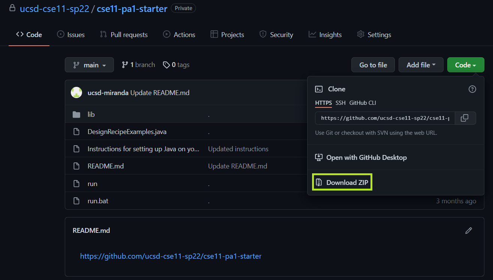
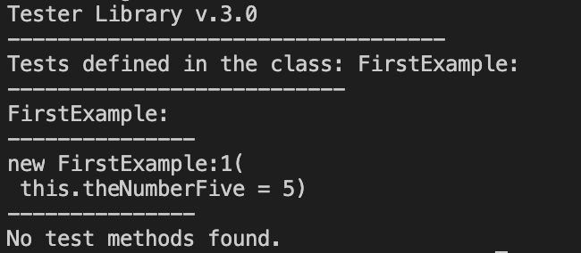

# Programming Assignment 1

### Due Date: Tuesday, January 17, 10:00PM Pacific Time

## Learning Goals
- Set up and test your Java development environment
- Write functions that take integer parameters and return integer results.
- Practice using design recipes

## FAQs

**Permission denied issue while trying to run lecture code (Mac/Linux)**

If you are working on Mac or Linux machines and you want to run the lecture code (or PA1) by using the run script, you might encounter an error that says

```
-bash: ./run: Permission denied
```

To solve this issue, run the following command first:

```
chmod +x run
```

before running the command `./run FirstExample`.

## Collaboration

Different assignments in this course have different collaboration policies.

On this assignment, you can collaborate with **anyone in the course**, including
**sharing code**. Feel free to offer help to other students, converse about the
*assignment, and so on.

In your submission, give credit to all students and course staff who helped you
with this assignment by noting their name and how you used their ideas or work.
Note that using someone's work without giving credit to them is a violation of
academic integrity.

## Start Early!

Research into deadlines and earliness of study work (i.e., when
students start working on exercises) has provided some insight into
work behavior and how that relates to study performance. Edwards
et al. [11] and Parson and Seidel [38] observed that starting early led
to better outcomes when compared to starting late, and Leinonen
et al. [28] observed that students who started early tended to have
better grades than those who started late

In general, the lack of time management skills among students
has been found to be related to lower academic performance [34],
which may manifest through a variety of ways. For example, poor
time management can manifest as procrastination, where tasks are
delayed until they can no longer be completed at an expected level
(or at all) [14]. Similarly, poor time management skills can lead to
poor study strategies including plagiarism [7], and can cause stress
and anxiety [37]. 

On the other hand, good time management is linked with higher
academic performance [34]. For example, students who start their
work earlier are likely to perform better (e.g., [9, 11, 36, 38]) and
distribute their work over multiple days (e.g., [8, 28]); this spacing
of work over multiple days can already have a significant effect on
learning [10, 17].

[Experiences With and Lessons Learned on Deadlines and
Submission Behavior](https://acris.aalto.fi/ws/portalfiles/portal/94250382/Experiences_With_and_Lessons_Learned_on_Deadlines_and_Submission_Behavior.pdf){:target="_blank"}


## Submission Checklist
Here is a list of items to check for before submitting PA1.

- [ ] CompileTimeErrors.java
- [ ] DesignRecipeExamples.java
  - [ ] Perimeter Method 
    - [ ] At least 2 tests, each with different parameters and a comment (at least 2) with the expected value of the test 
  - [ ] BorderArea Method 
    - [ ] At least 2 tests, each with different parameters and a comment (at least 2) with the expected value of the test 
  - [ ] Converter Method 
    - [ ] At least 2 tests, each with different parameters and a comment (At least 2) with the expected value of the test
    - [ ] 1 comment describing what the converter does, what parameters it takes, and any relevant outside sources
  - [ ] Combiner Method 
    - [ ] At least 2 tests, each with different parameters and a comment (at least 2) with the expected value of the test 
    - [ ] At least 1 test with parameters that produce an incorrect output and a comment explaining why the output is incorrect **OR** 1 comment describing why all parameters will produce the correct output
    - [ ] 1 comment describing what the combiner does, what parameters it takes, and any relevant sources.
- [ ] transcript.txt
  - [ ] Converter method output using the `run` command with at least 2 tests
  - [ ] Combiner method output using the `run` command with at least 2 tests

## Part 1 - Setting Up

- **On your own computer**: General instructions for setting up your environment can be found in [this document](https://github.com/ucsd-cse11-w23/cse11-pa1-starter/blob/main/Instructions%20for%20setting%20up%20Java%20on%20your%20own%20machine.pdf). There are specific video tutorials for [Windows](https://drive.google.com/file/d/1FxIAaGj7JAAN5QNpqcx1JBdv36yzX6TX/view?usp=sharing)  and [Mac](https://drive.google.com/file/d/1EsF6t_ZA7TIdQ0iIu9X_dh1T5YGmzxNG/view?usp=sharing).
- **In the CSE Labs**: Watch and follow the instructions from this video: [this video](https://drive.google.com/file/d/1LGvWU4jaMXDam9sGPO6oHXDMpZumOOhC/view). In text form, the instructions are:
  - If the lab computer is showing a Windows deskto or login, restart it and
    choose CentOS (first option) on the screen you get when it starts up.
  - Locate your CSE8B account, which you can find using the ACMS account lookup tool:
    [https://sdacs.ucsd.edu/~icc/index.php](https://sdacs.ucsd.edu/~icc/index.php).
    The username starts with "cs8bwi23". You will need to do an initial password
    reset, which you only need to do once. It may take up to 20 minutes for the new
    password to be effective.
  - Once you are logged in, you can follow the instructions for using Visual
  Studio Code to get fully set up

If you get stuck at any point, do any one of the following:
  - Take a screenshot and ask on Piazza! (Not sure how to take a screenshot? Try Googling it for your particular platform, like “screenshot microsoft windows” or “screenshot chromebook” or “screenshot os x”, or ask how on Piazza and we can help.)
  - [Ask for help!](https://ucsd-cse8b-w23.github.io/staff-and-help.html)

## Running Code

Download the starter code for this assignment by downloading this repository
using the “Download ZIP” button:
[https://github.com/ucsd-cse11-w23/cse11-pa1-starter](https://github.com/ucsd-cse11-w23/cse11-pa1-starter)

{:width="100%"}

Unzip the directory you downloaded, and open it in Visual Studio Code.

You will be creating a simple program from scratch by following the following steps.

1. Create a new file named `FirstExample.java`.

2. Create a new class named `FirstExample`

3. Create a new field of type `int` named `theNumberFive` and assign it the value of `5`

After completing these steps, you should have something similar to the following piece of code.

```
class FirstExample {
  int theNumberFive = 5;
}
```

Open the terminal, then run your program using `./run FirstExample` (Mac, Lab)
or `.\run.bat FirstExample` (Windows). You should see output similar to the following.

{:width="100%"}

Let's explore this program a little. We see that the code is encased inside `class FirstExample { ... }`. This means that we have created a new class using the `class` keyword and named it `FirstExample`. The `{` and `}` denote the beginning and end of the FirstExample class. Code we write will be contined inside classes. Classes in Java can contain many different types of information, two of which we will be focusing on in Part 2. They are `Fields` and `Methods`. The program we just wrote contains just one field.

`Fields` are named variables that belong to a class and are written outside of `Methods`. The class `FirstExample` contains a single field of type `int` named `theNumberFive` with an assigned value of `5`. Notice the line `int theNumberFive = 5;` and how it takes the form of `[Type] [Variable Name] = [Assigned Value];`. Additionally notice that it belongs to the class `FirstExample` and not to any method.

By using the `run` command, we are able to confirm several aspects of our program. We are able to identify our class via the line `new FirstExample:1( ... )`. The FirstExample class contains 1 field named `theNumberFive` and its value is `5`. We can use the `run` command to check that our program is working as you expect it to.

## Part 2 - Compile Time Errors

CompileTimeErrors.java has two methods and a test for each method. You can run the code with:

Mac and Lab:     ```./run CompileTimeErrors``` 

Windows:         ```.\run.bat CompileTimeErrors```

The code has several compile time errors. Fix the errors so that the code satisfies the following:
1. method `rightTriangleArea()`
  - takes a `double` called `base` and a `double` called `height` as its parameters
  - returns the area of a right triangle as `double` type calculated using the base and height given
2. method `squareNumber()`
  - takes an `int` called `myNumber`
  - returns the square of `myNumber` as `int` type
3. field `answer1`: tests the result of `rightTriangleArea()` with arguments 3, 5
4. field `answer2`: tests the result of `squareNumber()` with arguments 5

## Part 3 - Writing Methods

- You will write your code in DesignRecipeExamples.java. You can run the code to test it yourself with:

    Mac and Lab:     ```./run DesignRecipeExamples```
    
    Windows:         ```.\run.bat DesignRecipeExamples```
- For problem 3 and 4, you will use the following design recipe:
    1. Write the method header
    2. Write a short comment documenting the method (including assumptions, like if a parameter should take values only in a certain range)
    3. Write examples of calling the method
    4. Write the method body
    
    Using this recipe for problems 1 and 2 is optional, but highly encouraged.

- For problems 1 - 4, you will also write tests to ensure the correctness of your code. 

  To write a test, you will call the written method and assign it to a field that you create. When running your program using the ```run``` command, check to see if the actual output matches what you expect from the console.

  For problems 3 and 4, you will be creating a new file called `transcript.txt` and copy/pasting test output from the `run` command into it. See problems 3 and 4 for more details.

*(Several of these examples are borrowed from [How to Design Programs](http://www.htdp.org/2003-09-26/Book/curriculum-Z-H-6.html#node_sec_3.3), and its [Supplemental Material](http://www.htdp.org/2003-09-26/Problems/2.html))*

## Problem 1: Perimeter 
Develop a method named ```perimeter``` that when given an integer width and integer height of a rectangle will return its perimeter.

The rubric we will use to grade this method is:

- The method has a correct header (parameters and return type)
- The method has a correct method body
- There are at least two examples of calling the method with different arguments, commented with their expected values

## Problem 2: Border Area
Develop a method named ```borderArea``` that given 2 integers, width and height, describing a rectangle, and another 2 integers, width and height, describing a rectangle cut out of the center of the other, returns the area of the region between them. For example, the blue area in this shape:


- The method has a correct header (parameters and return type)
- The method has a correct method body
- There are at least two examples of calling the method with different arguments, commented with their expected values

## Problem 3: Converter 
### Implementation
Develop a method (with a name of your choice!) that takes one int parameter, converts it to another int value, and returns the new int value. For example, your function could convert:
- Fahrenheit to Celsius
- Between currencies

Write a comment for your method, describing what it does and what parameter it takes. If you use any outside sources for the conversion, be sure to cite those in the comment as well.

### Testing
Call your method on at least 2 different examples. Compare each result against a reference converter (Many search engines have built-in converters, or you can use a calculator) and add a comment above the function call to discuss differences (if any) that you get between your program and the reference.

- The method has a correct header (parameters and return type)
- The method has a method body that matches the examples you chose
- There are at least two examples of calling the method with different arguments, commented with their expected values
- In the file `transcript.txt`, show your program running and the expected values are produced by copy/pasting from the terminal.
- You can justify the output based on an external source or your own design description

## Problem 4: Combiner 
### Implementation
Develop a method (with a name of your choice!) that takes at least two int parameters, combines them to another int value, and returns the new int value. For example, your function could combine:
- Feet and inches into total in inches
- Starting hour and minute and end hour and minute into total number of minutes

Write a comment for your method, describing what it does and what parameters it takes. If you use any outside sources, be sure to cite those in the comment as well.

### Testing
Call your method on at least 2 different examples. Can you call your method with arguments that run, but produce an incorrect output? Call your method with at least one such pair of arguments, and add a comment above it explaining why the output is incorrect. If you cannot find such a pair of arguments, write a comment explaining why you believe no such input exists.

- The method has a correct header (parameters and return type)
- The method has a method body that matches the examples you chose
- There are at least two examples of calling the method with different arguments, commented with their expected values
- In the file `transcript.txt`, show your program running and the expected values are produced by copy/pasting from the terminal.
- You can justify the output based on an external source or your own design description

## Submission

Your submission will include the following:

1. [Part 2](#part-2---compile-time-errors): `CompileTimeErrors.java` (with your changes.)
2. [Part 3](#part-3---writing-methods): `DesignRecipeExamples.java` and `transcript.txt`.

Submit these files to the [PA1 Gradescope assignment](https://www.gradescope.com/courses/482393/assignments/2536617/). 

For a more detailed list of requirements, please go to the [submission checklist](#submission-checklist). 

## Grading

There are multiple oppurtunities to get feedback for PA1. By submitting before the deadline, you will receive feedback after it is graded shortly after the dealine. You may also submit to the Late/Resubmit for PA1 one time after the deadline to earn additional feedback.

For more information about the grading policy, visit the [course syllabus](https://ucsd-cse8b-w23.github.io/syllabus.html).
